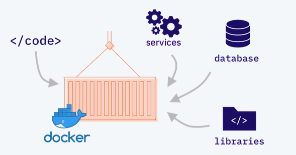

# Motivation
## Why Docker?

## First, A Quick Demo
### WeaveWorks Sock Shop

- [A microservices demo](https://microservices-demo.github.io/)

### WeaveWorks Sockshop Architecture

### How To Run It?
<pre><code>git clone \
    https://github.com/microservices-demo/microservices-demo.git
cd microservices-demo/deploy/docker-compose
docker-compose up -d
</pre></code>

## Common Development Headaches

### Dependency Hell

- Problem? 
	- Code is tightly coupled to the developer's local environment

- Solution?
	- Ship an application *and* it's environment

# Introductory Concepts

## What is an image?
- A self contained unit of packaging containing everything requried for an application to run
- A merged collection of read-only filesystem layers of one or more files
    - Typically represents a cut down file system
- Usually very small
    - The Alpine linux container is only around 5MB!

# Run through some examples
    - Docker installation
    - Have a git repo with slides and tagged steps
    - Run through the examples, highlight tagged steps
    - Learn to start, stop, restart and remove containers
        - Naming, interactive mode, auto remove mode
        - Mount file systems, open ports, set environment variables
    - Learn how to list containers
    - Learn how to attach to and execute code in a container
    - Learn how to build images and tag them
        - Learn Dockerfile syntax
            - FROM, RUN, COPY, CMD, EXPOSE, EXEC, ENTRYPOINT
        - Learn Docker image theory
            - What are layers?
            - How does the cache work?
            - What is a container registry
                - DockerHub
        - Dockerfile best practices
        - Multistage Docker images
        - .dockerignore
    - Docker secrets management
    - Docker Compose to run multiple containers and clean up the command line
    - CI CD pipeline to build and publish multipart container to Google Cloud Run
# Slide 3
<pre><code data-line-numbers="1|2|3-8|9|10-13|14|15">docker run -d
--publish 15789:1433
--env SA_PASSWORD=Testing1122
--env ACCEPT_EULA=Y
--env MSSQL_AGENT_ENABLED=True
--env MSSQL_DATA_DIR=/var/opt/sqlserver/sqldata
--env MSSQL_LOG_DIR=/var/opt/sqlserver/sqllog
--env MSSQL_BACKUP_DIR=/var/opt/sqlserver/sqlbackups
--network sqlserver
--volume sqlsystem:/var/opt/mssql
--volume sqldata:/var/opt/sqlserver/sqldata
--volume sqllog:/var/opt/sqlserver/sqllog
--volume sqlbackup:/var/opt/sqlserver/sqlbackups
--name sqlcontainer1
mcr.microsoft.com/mssql/server:2019-CU5-ubuntu-18.04
</pre></code>

