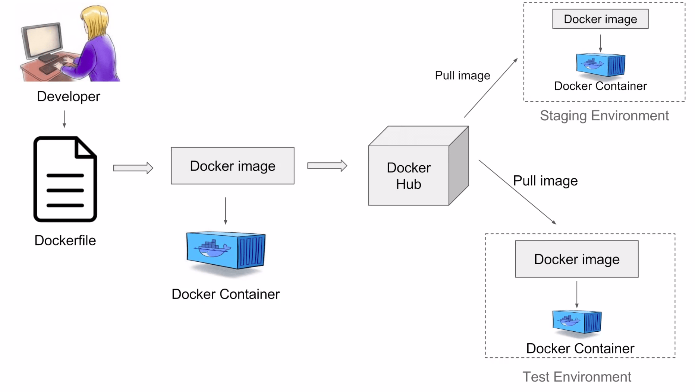

# Introduction

## `$ whoami`
- Overcaffinated fifth year MEng student
- Long time Docker user
- Likes terminals

## Who are you?
- A developer that has at some point been frustrated by terrible install instructions on GitHub...
- ... and has Docker installed on their computer...
	- Or has logged into play-with-docker.com
- ... and would like to learn a piece of technology that is rapidly becoming an industry standard

# Motivation
## Why Docker?

## First, A Quick Demo
### WeaveWorks Sock Shop

- [A microservices demo](https://microservices-demo.github.io/)

### WeaveWorks Sockshop Architecture

### How To Run It?
<pre><code>git clone \
    https://github.com/microservices-demo/microservices-demo.git
cd microservices-demo/deploy/docker-compose
docker-compose up -d
</pre></code>

## Common Development Headaches

### Dependency Hell

- Problem? 
	- Code is tightly coupled to the developer's local environment

### Dependency Hell

- Solution?
	- Ship an application *and* it's environment

## Why not use a VM?

- Docker containers are more lightweight and resource efficient
- However, VMs are more isolated and secure

# Introductory Concepts

## What Is An Image?
- A self contained unit of packaging containing everything requried for an application to run
- A merged collection of read-only filesystem layers of one or more files
    - Typically represents a cut down file system
- Usually very small
    - The Alpine linux container is only around 5MB!
- Reusing file system layers saves disk space and time

## What Is An Image?

## What Is A Container?
- A sandboxed process on your host that is isolated from all other processes and containers on the host
	- Leveages linux kernel cgroups and namespaces to achieve this user space isolation
- Is a runnable instance of an image
	- Container image provides the custom isolated filesystem that the container uses
- Are portable and runnable anywhere with a Docker engine installed

## What Is A Container?

## What Is A Registry?
- Storage and content delivery system for named Docker images
- Each image will usualy be available in many different tagged versions
- Users interact with the registry by using the docker pull and and docker push commands
- Uses DockerHub by default 

## What Is A Registry?

## To The Terminal!

## What Have We Done So Far?
- Pulled down images from a registry
- Learned how to create, start, stop, configure and interact with containers
- I know that was fast, but the README.md in the docker-masterclass-code repository has a command reference

# Dockerizing Your Applications!

## Docker Workflow

## Creating An Image - Dockerfile
- Dockerfiles contain instructions for creating images
- Can start from scratch or can build upon preexisting images
- Used with the `docker build` command
- Can be used with `docker push` if you're logged in to push your image up to DockerHub

## Persisting Data
- Containers so far have been ephemeral
	- Once the container is gone so is your data
- We can persist data with docker volumes
- This can either be a bind mount shared with the OS...
- Or a a docker volume which is stored as a directory within your Docker host
- Volumes use drivers, which let you add functionality

## Persisting Data

## Docker-Compose
- A tool used to define and share multi-container applications
- Services to be run and their configuration is defined by a YAML file
- Easily shareable and can be checked into version control
- Start entire application stacks with single command!

## Docker-Compose

## Get It In The Cloud - Google Cloud Run
- Develop and deploy highly scalable containerized applications on a fully managed serverless platform
- Every cloud service provider has an analog of this kind of service, say Amazon ECS, Digital Ocean Droplets, etc

## (Back) To The Terminal!

# That's all, folks!
## Any Questions?
